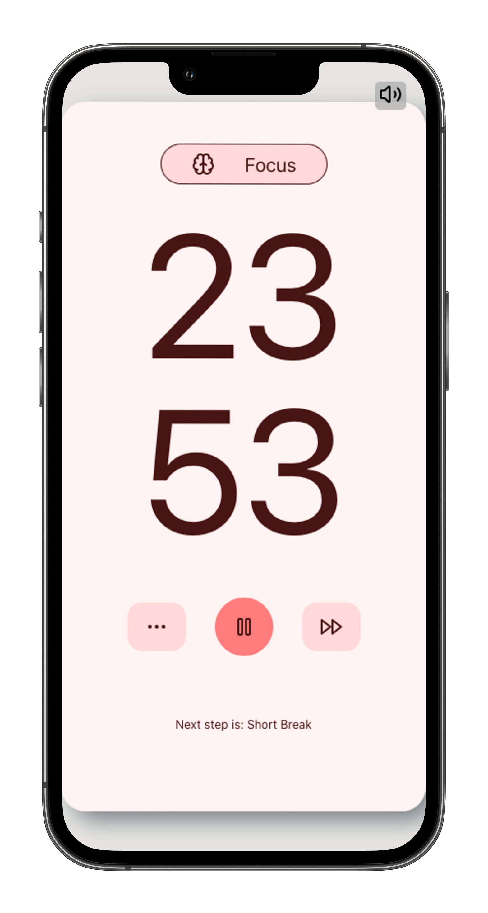

# Pomodoro :tomato:

## 📝 Project Overview

Welcome to the Infinite Pomodoro Timer Application! This project was developed over a week as a personal challenge to create an efficient and customizable Pomodoro timer. The app helps users alternate between work and break phases, following the Pomodoro technique. The design comes from [AlexandrLo's work](https://www.figma.com/community/file/1112830528857083939/pomo-pomodoro-timer-app-prototype-v-0-1-0), with a focus on simplicity and user experience.

One of the main challenges was managing the different states of the Pomodoro timer. The alternation between work and break phases required handling multiple state transitions simultaneously, such as starting, pausing, skipping, or resetting a phase. Each action had to take into account the remaining time, the active phase, and ensure smooth transitions between states.

A deployed version of the project is coming soon! 🚀

## ✨ Features

- **Custom work and break durations**: users can personalize the length of their work and break phases to fit their preferences.
- **Skip phases**: easily skip a phase and move to the next one if needed.
- **Start and pause timer**: manage the timer with a single click to start or pause.
- **Stop timer**: stop the timer and reset the phases if you need to start over.
- **Reset timer**: bring everything back to the initial state and default settings with the reset option.

## 🔧 Technologies Used

- React
- CSS
- `use-sound` React hook for audio management

## 🚀 How to Run the Project

TTo get the Pomodoro Timer Application running locally, follow these steps:

1. Clone the repository.
2. Run `npm install` in your terminal to install the necessary dependencies.
3. Start the development server using `npm run dev`.

You are now ready to go!

## ✅ Future Improvements

- [ ] Make the timer even more customizable
- [ ] Create a responsive design
